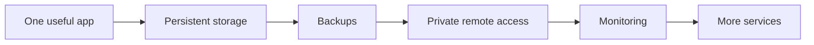

<div align="center">

# 🏠 Selfhosted Picks

### A curated shortlist of self-hosted apps actually worth running.

**Less catalogue. More signal.**  
Pick useful software, understand the trade-offs, and avoid turning your homelab into a graveyard of abandoned containers.

[](#)
[](#)
[](#)
[](#)

### [✨ Browse all picks](PICKS.md) · [📐 Selection criteria](CRITERIA.md) · [🧰 Build a homelab](https://github.com/ish4ra/homelab-from-zero)

</div>

---

## ✨ What makes this different?

There are already huge self-hosted lists with thousands of entries. This repo does **not** try to compete on list size.

It answers a more useful question:

> **“What would I genuinely keep running after the novelty wears off?”**

A project earns a place here when it solves a real problem, is realistic to maintain, and has a clear reason to self-host.

<table>
<tr>
<td width="33%" valign="top">

### ✅ Useful
Something you may actually use every week — not just install for a screenshot.

</td>
<td width="33%" valign="top">

### 🛠 Maintainable
Reasonable deployment, backups, updates and recovery for a home server.

</td>
<td width="33%" valign="top">

### 🔍 Honest
Every pick should have caveats, difficulty and resource expectations — not hype.

</td>
</tr>
</table>

---

## 🚀 Start with your goal

| I want to… | Start with | Why |
|---|---|---|
| 🔐 Host my passwords | **Vaultwarden** | Lightweight Bitwarden-compatible server |
| 📷 Replace cloud photo storage | **Immich** | Excellent personal photo/video library |
| 🎬 Build a media server | **Jellyfin** | Mature, subscription-free and flexible |
| 📄 Archive documents | **Paperless-ngx** | OCR + searchable document management |
| 🔄 Sync files between devices | **Syncthing** | Direct device-to-device synchronization |
| 🌐 Filter DNS/network ads | **AdGuard Home / Pi-hole** | Network-wide DNS control |
| 📡 Monitor services | **Gatus / Uptime Kuma** | Config-first or GUI-first monitoring |
| 🔖 Save useful links | **Karakeep / Linkwarden** | Bookmarking + archiving workflows |
| 📰 Read RSS | **Miniflux** | Fast, focused and low-maintenance |
| 🎵 Stream my music | **Navidrome** | Lightweight personal music server |
| 🎟 Manage media requests | **Seerr** | Shared request/discovery workflow |
| 🌍 Reach my server privately | **WireGuard / Tailscale** | Safer than exposing every service |

> **New to all of this?** Start with [homelab-from-zero](https://github.com/ish4ra/homelab-from-zero) before deploying ten apps at once.

---

## 💎 Beyond the obvious names

Already know Jellyfin, Immich, Vaultwarden and Home Assistant? These are the kinds of picks this repo is meant to surface:

| Project | What it does | Why it is interesting |
|---|---|---|
| **Gatus** | Uptime/status monitoring | Lightweight, config-as-code and Git-friendly |
| **Blocky** | DNS proxy/filtering | YAML-driven and easy to automate |
| **Yamtrack** | Tracks movies, TV, anime, games and books | Broad personal tracking with integrations |
| **Ampcast** | Unified music frontend | Brings multiple personal music sources together |
| **Karakeep** | Bookmark/read-later archive | Useful for saving links, notes and pages |
| **Memos** | Notes / micro-journal | Minimal, fast and easy to self-host |
| **PairDrop** | Browser-based file transfer | Great lightweight local sharing tool |
| **changedetection.io** | Web-page change monitoring | Perfect for watching prices, pages and notices |

### 👉 [See the full shortlist →](PICKS.md)

---

## 🧭 How every pick is judged

Each recommendation is evaluated using practical fields rather than just a one-line description.

```text
What does it replace?
Why self-host it?
How hard is setup?
How much hardware does it need?
Is Docker a sensible deployment path?
Who is it best for?
What are the important caveats?
```

### Difficulty

| Level | Meaning |
|---|---|
| 🟢 **Easy** | Straightforward container/app; minimal dependencies |
| 🟡 **Medium** | Requires storage, networking or service configuration |
| 🔴 **Advanced** | More moving parts, operational knowledge or recovery planning |

### Resource class

| Class | Meaning |
|---|---|
| 🪶 **Light** | Comfortable on small servers / low-power machines |
| ⚙️ **Moderate** | Normal mini-PC / home-server workload |
| 🧱 **Heavy** | Storage, database, indexing, transcoding or AI-heavy workload |

Read the full rules in **[CRITERIA.md](CRITERIA.md)**.

---

## 🧱 A sane self-hosted progression



If Mermaid does not render in your client, the idea is simple:

**one useful app → storage → backups → remote access → monitoring → then expand**

### Avoid this

```text
Day 1: install 30 containers
Day 2: expose half of them to the internet
Day 3: forget where the data lives
Day 30: one disk dies
```

---

## 🗂 Repository map

| File | Purpose |
|---|---|
| **[PICKS.md](PICKS.md)** | Full curated application shortlist |
| **[CRITERIA.md](CRITERIA.md)** | Rules for adding/removing recommendations |
| **README.md** | Quick navigation and philosophy |

---

## 🔗 Related guides

<table>
<tr>
<td width="50%" valign="top">

### 🧰 [Homelab From Zero](https://github.com/ish4ra/homelab-from-zero)
Build the infrastructure first: hardware, networking, Docker, backups and safe remote access.

</td>
<td width="50%" valign="top">

### 🌱 [Open Source Alternatives](https://github.com/ish4ra/open-source-alternatives)
A broader directory of open-source alternatives across desktop, web, mobile and self-hosted software.

</td>
</tr>
<tr>
<td width="50%" valign="top">

### 🎬 [Jellyfin Media Server Guide](https://github.com/ish4ra/jellyfin-media-server-guide)
Practical Jellyfin setup, clients, transcoding, plugins, remote access and troubleshooting.

</td>
<td width="50%" valign="top">

### 📱 [Android FOSS Starter Kit](https://github.com/ish4ra/android-foss-starter-kit)
Build a cleaner Android setup with FOSS apps, alternative sources and LineageOS.

</td>
</tr>
</table>

---

## 🤝 Contributing

Suggestions are welcome, but this repo intentionally avoids “list everything” growth.

Before suggesting a project, ask:

- Would I recommend this to someone today?
- Is there a strong reason to self-host it?
- Is the project healthy enough to depend on?
- Can I explain the caveats honestly?

Then read **[CRITERIA.md](CRITERIA.md)**.

---

<div align="center">

### Found something worth running?

If this shortlist saved you a weekend of installing apps you never use, consider leaving a ⭐.

**Curated > crowded.**

</div>